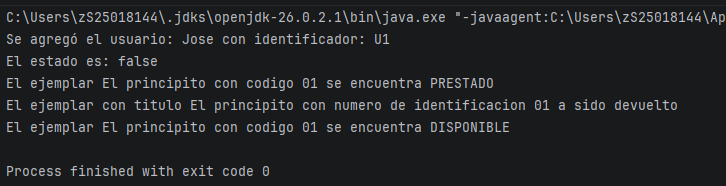

# Actividad 06 (En Parejas - Pair Programming): Paquetes, relaciones y documentación

## Integrantes:
### Morales Olan Jose Ruben - S24016701
### Torres Gonzalez Moises Geronimo - S25018144

---
## Preguntas:

**1. ¿Para qué sirve package?**

Para una mejor estructura y entendimiento de los modulos de nuestra aplicación

**2. ¿Para qué sirve import?**

Para poder utilizar bibliotecas u otras clases

**3. ¿Qué relación existe entre paquete y directorio?**

Que los paquetes son para agrupar clases, interfaces u otros paquetes y reducir la complejidad y el directorio es para almacenar archivos de JAVA

**4. ¿Qué es Javadoc?**

Una herramienta de JAVA que genera documentacion en HTML

5. ¿Qué diferencia hay entre // y //** ... */¨ ?

"//" permite solo comentarios en una sola linea y "/** ... */" es para escribir comentarios en multiples lineas 

